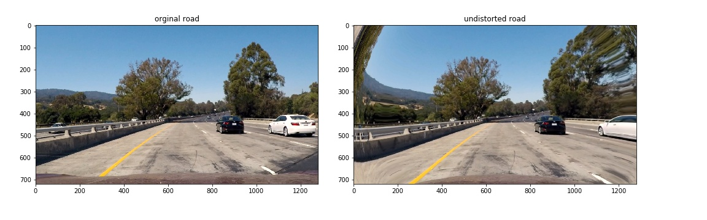

## Advanced Lane Finding Project

The goals / steps of this project are the following:

* Compute the camera calibration matrix and distortion coefficients given a set of chessboard images.
* Apply a distortion correction to raw images.
* Use color transforms, gradients, etc., to create a thresholded binary image.
* Apply a perspective transform to rectify binary image ("birds-eye view").
* Detect lane pixels and fit to find the lane boundary.
* Determine the curvature of the lane and vehicle position with respect to center.
* Warp the detected lane boundaries back onto the original image.
* Output visual display of the lane boundaries and numerical estimation of lane curvature and vehicle position.

## theory of pipeline

The pipeline is included by multiple functions,
they are camera calibration, etc...

### Camera Calibration

#### 1. Briefly state how you computed the camera matrix and distortion coefficients. Provide an example of a distortion corrected calibration image.

The code for this step is contained in the fourth the cell of the IPython notebook located in "p2.ipynb"

I started by copy the original image as 'undist', and I convert the image format into gray format, then I use the _cv2.findChessboardCorners_ to confirm the chessboard corners coordination (x, y, z) which are imgae points. then I define the object points (x,y,z) which are the order of chessboard corners order, e.g. (0, 0, 0), (1, 0, 0) until (8, 5, 0) and here we just assume the z equals zero during the whole conversion.

once we get the image points on imput pictures and object points, by using _cv2.calibrateCamera_ function we can get the distortion parameters, mtx, dist, rvecs, tvecs, then using _cv2.undistort_ can get the undistorted picture.

finally we can use these parameters to calibrate the road images.

below are two examples of camera calibrations


below are comparison from original camera picture to distortion corrected picture


### Pipeline (single images)

#### 1. Provide an example of a distortion-corrected image.

belwo are original undistorted image and distortion-corrected image comaprison, the most obvious place on the image is the car hood on the bottom edge of picture, the distortion-corrected image has less area of car hood.

below are two examples of unwarped road images



#### 2. Describe how (and identify where in your code) you used color transforms, gradients or other methods to create a thresholded binary image.  Provide an example of a binary image result.

I used a combination of absolute sobel gradients threshold along x, y direction, sobel gradients magitude threshold, sobel gradients direction threshold and HLS channel threshold, I tried multiple value combo and figure out the most confident threshold valve value, belows are the threshold value selection step by step.


#### 3. Describe how (and identify where in your code) you performed a perspective transform and provide an example of a transformed image.

perspective transfrom function is conducted by  pres_trans(gray, offset=10)
first of all, the source points and destination points are hard coded as following:
```
offset = 10
source points:
    left_bottom = [140+offset, ysize]
    right_bottom = [1230-offset, ysize]
    left_top = [530+offset, 460+offset]
    right_top = [780-offset, 460+offset]
src = np.float32([left_bottom, right_bottom, left_top, right_top])
destition points:
    dst = np.float32([[0, ysize], [xsize, ysize], [0, 0], [xsize, 0]])
```

This resulted in the following source and destination points:

| Source        | Destination   | 
|:-------------:|:-------------:| 
| 150, 720      | 0, 720        | 
| 1220, 720     | 1280, 720     |
| 540, 470      | 0, 0          |
| 770, 470      | 1280, 0       |

I verified that my perspective transform was working as expected by drawing the `src` and `dst` points onto a test image and its warped counterpart to verify that the lines appear parallel in the warped image.


#### 4. Describe how (and identify where in your code) you identified lane-line pixels and fit their positions with a polynomial?

first of all, prespective transfrom function will generate the output image as gray format, called as binary_warped,

Then by define the function called _find_lane_pixels(binary_warped)_, it will first sum up the pixel which value equals one in binary warped along the y axis, then find the two peaks on the left side and right side, we will assume these two peaks are the middle points of drive lines.

after inital the start point of driving lines, the image will be splited to 9 pieces horizontally, this is because the driving lines will have some cruvatures, so the middle points need update after every iterations, under this assumption, the middle points will be updated 9 times.

In every window of 9 windows splited before, all nonzero pixels, which will show white color in the image will be added multiple limitations by x, y coordinations, they are hard coded as below:
In the following coding, the leftx_current and rightx_current are the middle point of current window at left and right side.
```
win_y_low = binary_warped.shape[0] - (window+1)*window_height
win_y_hig = binary_warped.shape[0] - window*window_height
win_xleft_low = leftx_current - margin
win_xleft_high = leftx_current + margin
win_xright_low = rightx_current - margin
win_xright_high = rightx_current + margin
```

the filter will be added in the following method:
```
good_left_inds = ((nonzeroy >= win_y_low) & (nonzeroy < win_y_high) & (nonzerox >= win_xleft_low) &  (nonzerox < win_xleft_hig                   h)).nonzero()[0]
good_right_inds = ((nonzeroy >= win_y_low) & (nonzeroy < win_y_high) & (nonzerox >= win_xright_low) &  (nonzerox < win_xright_h                    igh)).nonzero()[0]
        
```

then all good pixels will be collected in the numpy array, and marked as red/blue color.
# _put red/blue marked road lines image here_

after all the iterations, we will get all good pixels in road, and by using function np.polyfit(), we can generate polynomial paramters for left/right driving lines, we split the image along the y direction evenly, and using the polynomial parameters to generate the x coordination and plot them on the image which are the polynomial curve for driving lines
# _put polynomial curve road lines image here_

#### 5. Describe how (and identify where in your code) you calculated the radius of curvature of the lane and the position of the vehicle with respect to center.

Since I've gotten the polynomial curve function for left/right driving lines above, so first of all I need to get middle polynomial curve from left/right curve, by average the left/right x-axis coordination, we can get the average x coordinations, and using the y coordinations and np.polyfit() above, the middle curve can be calculated easily.

by using the middle polynomial parameters above the curvature can be calculated as follow:
```
mid_curverad = (1+((2*mid_fit[0]*y_eval+mid_fit[1])**2)**(3//2))/(np.abs(2*mid_fit[0]))  ## Implement the calculation of the left line here
```

#### 6. Provide an example image of your result plotted back down onto the road such that the lane area is identified clearly.

When flip the source points and image points when you do the prespective transfrom from reginal masking road to plane view, you can easily get the Minv parameter set. 
So that you can use cv2.warpPrespective() with Minv to convert the prespective transformed image back to the nomral camera image shape easily. 
Then using the cv2.addWeighted() to combine the original image with the detected road lines
# _put final result here_


### Pipeline (video)

#### 1. Provide a link to your final video output.  Your pipeline should perform reasonably well on the entire project video (wobbly lines are ok but no catastrophic failures that would cause the car to drive off the road!).
# _put final result vedio here_

### Discussion

#### 1. Briefly discuss any problems / issues you faced in your implementation of this project.  Where will your pipeline likely fail?  What could you do to make it more robust?

the most important part I think is to take care of the image matrix values' type, I stuck on the image converstion very long time because of this. all image has to be at same type and also when you forcely conver the binary gray image to RGB format, you should multiple all vlaues by 255 to fulfil the scale RGB using.

